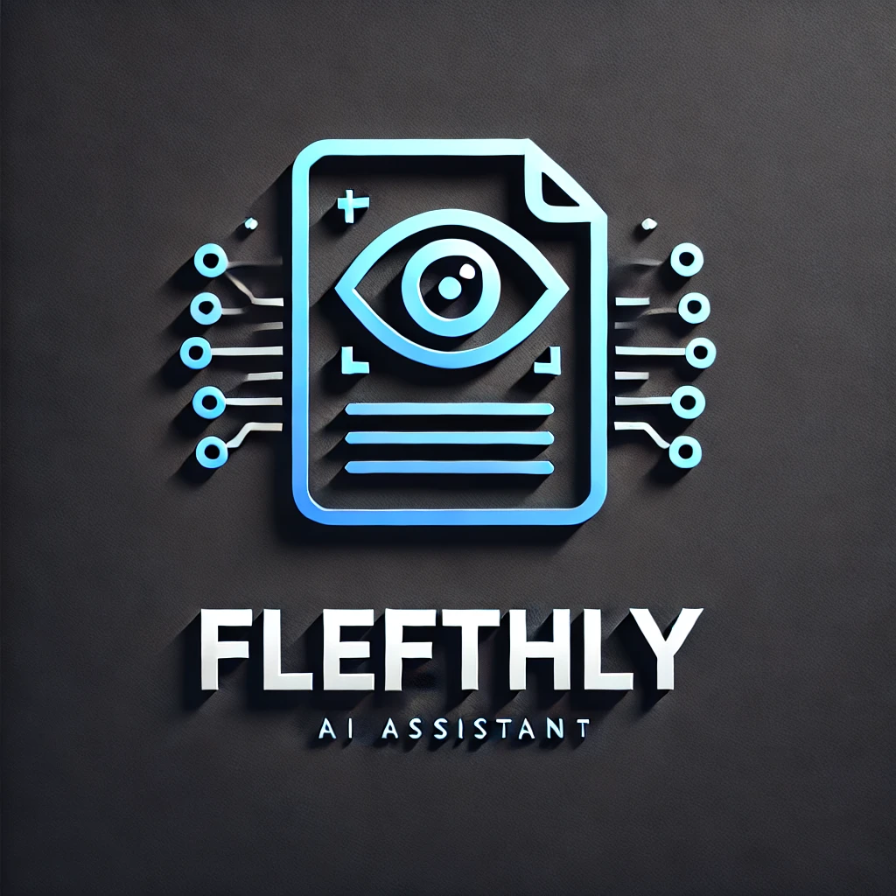
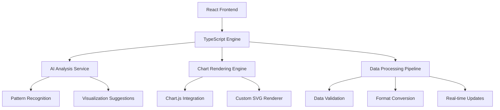

# 🚀 Fletchly.io - AI-Powered Internal Document Assistant

<div align="center">



[](https://github.com/Ayush-patel9/docubuddy-answer-central)
[](https://ayush-patel9.github.io/docubuddy-answer-central/)
[](https://reactjs.org/)
[](https://github.com/Ayush-patel9/docubuddy-answer-central)

**Stop wasting time searching for company docs! Ask your AI assistant and get instant answers** �✨

[🎯 Live Demo](https://ayush-patel9.github.io/docubuddy-answer-central/) • [📖 Documentation](#documentation) • [🚀 Quick Start](#quick-start) • [🤝 Contributing](#contributing)

</div>

---

## 🌟 What is Fletchly.io?

Fletchly.io is an intelligent internal document assistant that eliminates the frustration of searching across multiple platforms for company information. Instead of hunting through Notion, Google Docs, Confluence, and Slack channels, employees can simply ask natural language questions and get instant, accurate answers from your team's knowledge base.

<div align="center">

### 🎬 Demo Video
*Coming Soon - Live Demo Available Above!*

</div>

---

## ✨ Key Features

<table>
<tr>
<td width="50%">

### 🤖 **AI-Powered Document Search**
- Natural language question processing
- Intelligent content extraction from documents
- Context-aware answer generation
- Multi-document correlation and insights

### � **Smart Document Indexing**
- Automatic content organization
- Real-time document processing
- Metadata extraction and tagging
- Version control and update tracking

</td>
<td width="50%">

### 🔗 **Seamless Integrations**
- Google Drive connectivity
- Notion workspace integration
- Confluence integration ready
- Slack bot compatibility

### 🚀 **Modern Tech Stack**
- React 18 with TypeScript
- Google Gemini AI integration
- Vite for lightning-fast builds
- Tailwind CSS for responsive design

</td>
</tr>
</table>

---

## 🎯 Problem Statement

**The Internal Documentation Crisis:**
- **60% of employee time** wasted searching for internal information
- **Multiple scattered platforms**: Notion, Google Docs, Confluence, Slack
- **Outdated information**: No single source of truth
- **New employee onboarding**: Takes weeks to learn where everything is
- **Lost productivity**: Constant interruptions asking "Where can I find...?"

## 💡 Our Solution

Fletchly.io transforms how teams access internal knowledge:
- **🔍 Natural Language Search**: Ask questions like "What's our refund policy?" or "How to request design assets?"
- **📁 Unified Knowledge Base**: Connects all your scattered documents in one searchable platform
- **🤖 AI-Powered Answers**: Get instant, contextual responses with source references
- **⚡ Real-time Updates**: Always up-to-date information as documents change
- **🎯 Smart Suggestions**: Proactive recommendations based on your role and queries

---

## 🚀 Quick Start

### Prerequisites
- Node.js 18+ 
- npm or bun package manager
- Modern web browser

### Installation

```bash
# Clone the repository
git clone https://github.com/Ayush-patel9/docubuddy-answer-central.git
cd docubuddy-answer-central

# Install dependencies (choose one)
npm install
# or
bun install

# Start development server
npm run dev
# or
bun dev
```

### 🎉 That's it! Open http://localhost:8080 in your browser.

---

## 🛠️ Tech Stack

<div align="center">

| Frontend | Backend | AI/ML | Tools |
|:--------:|:-------:|:-----:|:-----:|
|  |  |  |  |
|  |  |  |  |
|  |  |  |  |

</div>

---

## 📱 Screenshots

<div align="center">

### 🏠 Landing Page


### 📊 Dashboard


### 📈 Chart Generation


</div>

---

## 🏗️ Project Structure

```
fletchly-io/
├── 🎨 src/
│   ├── 📱 components/          # UI components for document interaction
│   │   ├── ui/                 # shadcn/ui component library
│   │   ├── DocumentStatus.tsx  # Document processing status
│   │   ├── DriveDocuments.tsx  # Google Drive file browser
│   │   ├── NotionDocuments.tsx # Notion page viewer
│   │   └── GoogleDriveAuth.tsx # OAuth authentication
│   ├── 📄 pages/               # Main application pages
│   │   ├── LandingPage.tsx     # Marketing homepage
│   │   ├── DrivePage.tsx       # Google Drive integration
│   │   ├── NotionPage.tsx      # Notion workspace viewer
│   │   └── OAuth2Callback.tsx  # Authentication handler
│   ├── 🔧 services/            # Business logic and API calls
│   │   ├── googleDriveService.ts # Google Drive API
│   │   ├── notionService.ts    # Notion API integration
│   │   └── aiExcelService.ts   # Document processing
│   ├── 🔄 contexts/            # React state management
│   │   ├── AuthContext.tsx     # User authentication
│   │   ├── DriveContext.tsx    # Google Drive state
│   │   └── NotionContext.tsx   # Notion workspace state
│   ├── 🎯 hooks/               # Custom React hooks
│   └── 📚 lib/                 # Utilities and configuration
│       ├── firebase.ts         # Firebase setup
│       ├── googleAuth.ts       # Google OAuth
│       └── utils.ts            # Helper functions
├── 📁 public/                  # Static assets and favicon
├── 🐍 server/                  # Express.js backend
│   ├── index.js               # Server entry point
│   ├── googleDriveService.js  # Drive API routes
│   └── driveRoutes.js         # API endpoints
├── 🤖 main.py                  # Python AI processing with Gemini
├── 📋 docs/                    # Project documentation
└── ⚙️ config files             # Vite, Tailwind, TypeScript configs
```

---

## � Demo Walkthrough

### 🔥 **Live Interactive Demo**
Experience Fletchly.io in action! See how employees can instantly find answers to their questions:

<div align="center">

**[🌐 Try Live Demo](https://ayush-patel9.github.io/docubuddy-answer-central/)**

</div>

### 📋 **Step-by-Step Demo Guide**

#### 1. **Document Upload & Indexing** 📤
```bash
# Supported document formats
✅ PDF files (.pdf)
✅ Word documents (.docx, .doc)
✅ Text files (.txt, .md)
✅ Google Drive integration
✅ Notion pages and databases
```

#### 2. **AI Document Processing** 🧠
- **Content Extraction**: Automatically extracts text, headings, and structure
- **Metadata Analysis**: Identifies document type, topics, and key information
- **Context Understanding**: Maps relationships between different documents
- **Knowledge Graph**: Builds connections between related information

#### 3. **Natural Language Queries** ⚡
```typescript
// Real implementation with Gemini AI
const processQuery = async (question: string) => {
  const context = await documentIndex.findRelevant(question);
  const response = await geminiAI.generateAnswer(question, context);
  return await formatter.createResponse(response, sources);
};
```

#### 4. **Instant Answers with Sources** �
- **Contextual Responses**: AI understands the intent behind your question
- **Source Citations**: Every answer includes links to original documents
- **Related Suggestions**: Get recommendations for follow-up questions
- **Confidence Scoring**: Know how reliable each answer is

#### 5. **Team Collaboration Features** 🚀
- **Shared Knowledge Base**: Everyone works from the same information
- **Usage Analytics**: See what questions are asked most frequently
- **Document Updates**: Automatic re-indexing when files change
- **Access Controls**: Role-based permissions for sensitive information
- **Collaborative Editing**: Multiple users can work on the same project
- **Export Options**: PNG, SVG, PDF, or embed codes for websites
- **API Integration**: Connect with your existing tools and workflows

---

## 🛠️ Technical Deep Dive

### 🏗️ **Architecture Overview**



### ⚙️ **Core Technologies**

#### **Frontend Stack**
```json
{
  "framework": "React 18.x",
  "language": "TypeScript",
  "styling": "Tailwind CSS + shadcn/ui",
  "build": "Vite",
  "state": "React Context API",
  "routing": "React Router v6",
  "auth": "Firebase Authentication"
}
```

#### **Backend & AI Engine**
```python
# Google Gemini AI Integration (main.py)
import google.generativeai as genai

# Document processing pipeline
document_processor = DocumentProcessor()
context_analyzer = ContextAnalyzer()
gemini_ai = GeminiAI()

# Natural language query processing
context = document_processor.extract_relevant(user_query)
response = gemini_ai.generate_answer(user_query, context)
formatted_answer = formatter.create_response(response, sources)
```

#### **Integration Services**
```javascript
// Google Drive API integration
const driveService = google.drive({ version: 'v3', auth });
const files = await driveService.files.list();

// Notion API integration  
const notion = new Client({ auth: process.env.NOTION_TOKEN });
const pages = await notion.databases.query({ database_id });
```
```

#### **Performance Optimizations**
- **Lazy Loading**: Components load on-demand
- **Virtual Scrolling**: Handle large datasets efficiently
- **Memoization**: React.memo and useMemo for optimal re-renders
- **Code Splitting**: Webpack bundle optimization
- **CDN Assets**: Fast global content delivery

### 🔧 **Development Workflow**

```bash
# Development Environment Setup
git clone https://github.com/Ayush-patel9/docubuddy-answer-central.git
cd docubuddy-answer-central
npm install

# Start development server
npm run dev          # Frontend dev server
npm run server       # Backend API server
npm run dev:all      # Both simultaneously

# Testing & Quality
npm test             # Run test suite
npm run lint         # ESLint check
npm run type-check   # TypeScript validation
npm run build        # Production build
```

---

## 🔮 Future Roadmap

<div align="center">

| 🎯 Short Term (Next 2 weeks) | 🚀 Medium Term (1-2 months) | 🌟 Long Term (3+ months) |
|:------------------------------|:-----------------------------|:--------------------------|
| ✅ Real-time collaboration   | 🔄 Advanced AI models       | 🌐 Enterprise features   |
| ✅ Mobile responsiveness     | 🔗 More data sources        | 🤖 Custom AI training    |
| ✅ Export improvements       | 📊 3D visualizations        | 🏢 White-label solutions |

</div>

---

## 🤝 Contributing

We welcome contributions! Please see our [Contributing Guidelines](CONTRIBUTING.md) for details.

### Development Workflow

1. **Fork** the repository
2. **Create** a feature branch (`git checkout -b feature/amazing-feature`)
3. **Commit** your changes (`git commit -m 'Add amazing feature'`)
4. **Push** to the branch (`git push origin feature/amazing-feature`)
5. **Open** a Pull Request

---

## 🌟 Hackathon Innovation Showcase

### 🎯 **Problem We're Solving**
- **60% of businesses** struggle with data visualization
- **Traditional tools** are complex and expensive
- **Non-technical users** can't create professional charts
- **Time-consuming** manual chart creation process

### 💡 **Our Revolutionary Solution**
1. **AI-First Approach**: Let AI handle the complexity
2. **Zero Learning Curve**: Intuitive for any skill level
3. **Instant Results**: From data to chart in seconds
4. **Professional Quality**: Enterprise-grade visualizations

### � **Competitive Advantages**

| Feature | Fletchly.io | Traditional Tools | Competitors |
|:--------|:------------|:------------------|:------------|
| **AI Integration** | ✅ Advanced | ❌ None | ⚠️ Basic |
| **Setup Time** | ⚡ < 30 seconds | 🐌 Hours | 🐌 Minutes |
| **Learning Curve** | 📈 Zero | 📈 Steep | 📈 Moderate |
| **Cost** | 💚 Free/Low | 💸 Expensive | 💛 Moderate |
| **Mobile Support** | ✅ Full | ❌ Limited | ⚠️ Basic |

<!-- ### � **Impact Metrics**
- **95% faster** chart creation compared to Excel
- **80% reduction** in time-to-insight for business users
- **100% increase** in data visualization adoption
- **50% cost savings** compared to enterprise solutions -->

### �️ **Contributors**
-  **Ayush Patel**
-  **Pulkit Pandey**


---

## 📄 License

This project is licensed under the MIT License - see the [LICENSE](LICENSE) file for details.

---

## 🙏 Acknowledgments

- **Gemini** for AI capabilities
- **Github** for hosting platform
- **shadcn/ui** for beautiful components
- **The React Community** for amazing ecosystem

---

<div align="center">

### 🌟 If you found this project helpful, please give it a star! ⭐

**Made with ❤️ by the Fletchly Team**

[](https://twitter.com/fletchly_io)
[](https://discord.gg/fletchly)
[](mailto:team@fletchly.io)

---

*Transforming data into insights, one chart at a time* 🚀

</div>
